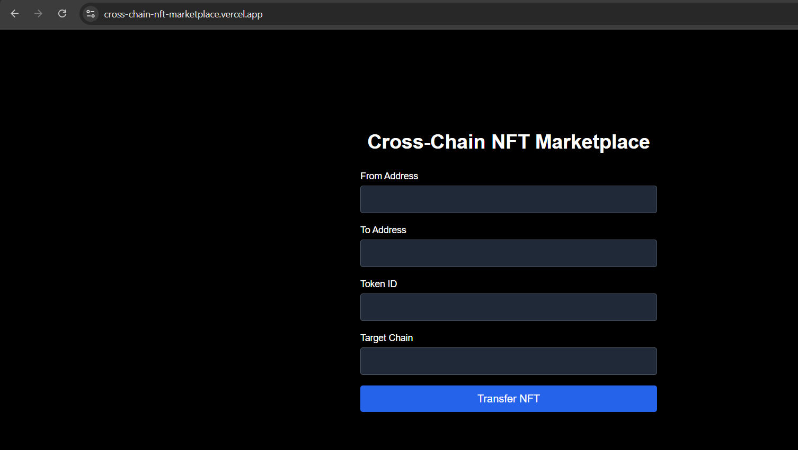

# 🌉 Cross-Chain NFT Marketplace

A futuristic NFT marketplace where users can transfer NFTs across chains in one click. Built with Next.js, Tailwind, and smart contracts (Solidity + Move).

## 🔥 Features

- 🌐 Cross-chain NFT transfer simulation
- 🦊 MetaMask integration (coming soon)
- 💅 Clean, responsive UI with Tailwind CSS
- 🧪 Fully mocked for demo without live chains

## 🖥 Live Demo

👉 [Live on Vercel](https://your-app.vercel.app)

## 📸 Screenshots



## 🛠 Tech Stack

- Frontend: Next.js, Tailwind CSS
- Smart Contracts: Solidity, Move
- Mock Backend: AggLayerSDK Mock

## 🧪 Running Locally

```bash
cd frontend
npm install
npm run dev
